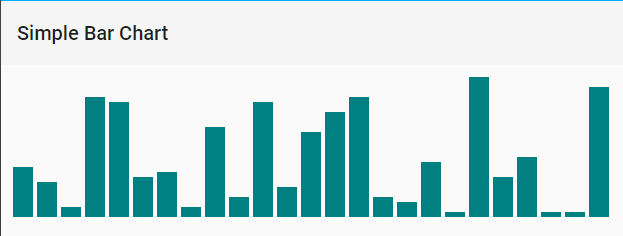
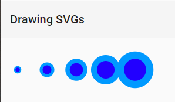
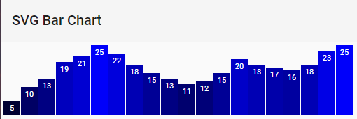
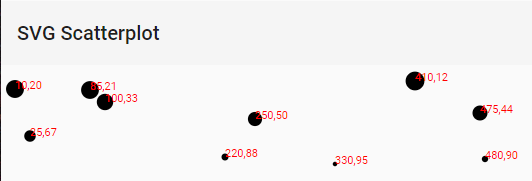

# Drawing with Data

`attr()` sets DOM attribute values, whereas `style()` applies CSS styles directly to an element.

`attr()` is used to set an HTML attribute and its value on an element. An HTML attribute is any property / value pair that you could include between an element's brackets.

```html
<p class="caption"></p>
<select id="country"></select>

```

Attribute | Value
----------|------
class | caption
id | country
src | logo.png
width | 100px
alt | Logo

If you want to add or remove a class from an element, you can use the `classed()` function. It accepts a string and a boolean argument, which correspond to the class and whether it is being added or removed: `.classed('bar', true)` adds the `bar` class, and `.classed('bar', false)` removes the `bar` class.

## Bar Chart Component  

**bar-chart.component.scss**  

```scss
div.bar {
  display: inline-block;
  width: 20px;
  margin-right: 4px;
}
```  

**bar-chart.component.html**  

```html
<section #target
         class="container"></section>
```

**bar-chart.component.ts**

```ts
import {
  Component,
  Input,
  OnInit,
  ViewEncapsulation,
  ViewChild,
  ElementRef
} from '@angular/core';

import * as d3 from 'd3';

@Component({
  selector: 'bar-chart',
  templateUrl: 'bar-chart.component.html',
  styleUrls: ['bar-chart.component.scss'],
  encapsulation: ViewEncapsulation.None
})
export class BarChartComponent implements OnInit {
  @Input() dataset: Array<number>;
  @Input() color = 'teal';

  @ViewChild('target', { static: true }) target: ElementRef;

  ngOnInit() {
    d3.select(this.target.nativeElement)
      .selectAll('div')
      .data(this.dataset)
      .enter()
      .append('div')
      .attr('class', 'bar')
      .style('height', d => `${d * 5}px`)
      .style('background-color', this.color);
  }
}
```

**home.component.html**  

```html
<mat-toolbar>Simple Bar Chart</mat-toolbar>
<bar-chart [dataset]="dataset"></bar-chart>
```

**home.component.ts**  

```ts
import {
  Component,
  OnInit
} from '@angular/core';

@Component({
  selector: 'home',
  templateUrl: 'home.component.html'
})
export class HomeComponent implements OnInit {
  dataset = [27, 7, 5, 26, 11, 8, 25, 14, 23, 19, 14, 11, 22, 29, 11, 13, 12, 17, 18, 10, 24, 18, 25, 9, 3];

  private getRandom = (max: number = 30) => Math.floor(Math.random() * max);

  ngOnInit() {
    this.dataset = new Array<number>();

    for (let i = 0; i < 25; i++) {
      this.dataset.push(this.getRandom());
    }
  }
}
```  

[](01-simple-bar-chart.png)

## Drawing SVGs

One thing to notice about SVG elements is that all of their properties are specified as *attributes*. That is, they are included as property / value pairs within each element tag, like this:

```html
<element property="value"></element>
```

Because SVG elements exist in the DOM, just as HTML elements do, we can use `append()` and `attr()` in exactly the same way to generate SVG images.

### Drawing SVG Component

**drawing-svg.component.html**

```html
<section #target
         class="container"></section>
```

**drawing-svg.component.ts**

```ts
import {
  Component,
  Input,
  OnInit,
  ViewChild,
  ElementRef
} from '@angular/core';

import * as d3 from 'd3';

@Component({
  selector: 'drawing-svg',
  templateUrl: 'drawing-svg.component.html'
})
export class DrawingSvgComponent implements OnInit {
  @Input() dataset: Array<number>;
  @Input() width = 500;
  @Input() height = 100;
  @Input() fill = `#2200ff`;
  @Input() stroke = `#0099ff`;

  @ViewChild('target', { static: true }) target: ElementRef;

  svg: d3.Selection<SVGSVGElement, unknown, HTMLElement, any>;

  ngOnInit() {
    this.svg = d3.select(this.target.nativeElement)
                 .append('svg')
                 .attr('width', this.width)
                 .attr('height', this.height);

    this.svg.selectAll('circle')
            .data(this.dataset)
            .enter()
            .append('circle')
            .attr('cx', (d, i) => (i * 50) + 25)
            .attr('cy', this.height / 2)
            .attr('r', d => d)
            .attr('fill', this.fill)
            .attr('stroke', this.stroke)
            .attr('stroke-width', d => d / 2);
  }
}
```

**home.component.html**

```html
<mat-toolbar>Drawing SVGs</mat-toolbar>
<drawing-svg [dataset]="drawingSvgData"></drawing-svg>
```

**home.component.ts**

```ts
drawingSvgData = [5, 10, 15, 20, 25];
```

[](.images/02-drawing-svgs.png)

## Making a Bar Chart

**svg-bar-chart.component.html**

```html
<section #target
         class="container"></section>
```

**svg-bar-chart.component.ts**

```ts
import {
  Component,
  OnInit,
  Input,
  ViewChild,
  ElementRef
} from '@angular/core';

import * as d3 from 'd3';

@Component({
  selector: 'svg-bar-chart',
  templateUrl: 'svg-bar-chart.component.html'
})
export class SvgBarChartComponent implements OnInit {
  @Input() dataset: Array<number>;
  @Input() width = 500;
  @Input() height = 100;
  @Input() barPad = 1;
  @Input() barScale = 4;
  @Input() textX = 5;
  @Input() textY = 14;
  @Input() labelSize = '11px';
  @Input() fillColor = 'white';
  @Input() fill = (scale: number) => `rgb(0, 0, ${scale})`

  @ViewChild('target', { static: true }) target: ElementRef;

  svg: d3.Selection<SVGSVGElement, unknown, HTMLElement, any>;

  ngOnInit() {
    this.svg = d3.select(this.target.nativeElement)
                 .append('svg')
                 .attr('width', this.width)
                 .attr('height', this.height);

    this.svg.selectAll('rect')
            .data(this.dataset)
            .enter()
            .append('rect')
            .attr('x', (d, i) => i * (this.width / this.dataset.length))
            .attr('y', d => this.height - (d * this.barScale))
            .attr('width', this.width / this.dataset.length - this.barPad)
            .attr('height', d => d * this.barScale)
            .attr('fill', d => this.fill(Math.floor(Math.round(d * 10))));

    this.svg.selectAll('text')
            .data(this.dataset)
            .enter()
            .append('text')
            .text(d => d)
            .attr('x', (d, i) => i * (this.width / this.dataset.length) + (this.width / this.dataset.length - this.barPad) / 2)
            .attr('y', d => this.height - (d * this.barScale) + this.textY)
            .attr('font-size', this.labelSize)
            .attr('fill', this.fillColor)
            .attr('text-anchor', 'middle');
  }
}
```

**home.component.html**

```html
<mat-toolbar>SVG Bar Chart</mat-toolbar>
<svg-bar-chart [dataset]="svgBarData"></svg-bar-chart>
```

**home.component.ts**

```ts
svgBarData = [5, 10, 13, 19, 21, 25, 22, 18, 15, 13, 11, 12, 15, 20, 18, 17, 16, 18, 23, 25];
```

[](.images/03-svg-bar-chart.png)

## Scatterplot

When visualizing quantitative values with circles, make sure to encode the values as *area*, not as a circle's *radius*. Perceptually, humans interpret the overall amount of "ink" or pixels (the area) to reflect the data value. A common mistake is to map the value to the radius, which would vastly overrepresent the data and distort the relative relationship between values. Mapping to the radius is easier to do, as it requires less math, but the result will visually distort your data.

When creating SVG circles, we can't specify an area value; we have to calculate the radius r and then set that. Starting with a data value as area, how do we get the radius value?

You might remember that the area of a circle equals **pi** times the radius squared, or `A = pi*r^2`.

```
A = pi*r^2            // Original equation for area
A / pi = r^2          // Divide both sides by pi
sqrt ( A / pi ) = r   // Take the square root of both sides
r = sqrt ( A / pi )   // Flip the equation around for legibility
```

This would result in the radius of the circle being calculated as follows:

```ts
.attr('r', d => Math.sqrt((this.height - d[1]) / Math.PI))
```

However, division by `Math.PI` can be omitted, resulting in the simpler:

```ts
.attr('r', d => Math.sqrt(this.height - d[1]))
```

If the "area" here were an actual area value of an actual, measured circle - such as that of an 18-inch pizza - then w should divide by pi. But since the "areas" of the circles are just arbitrary data values and not real-life measurements, dividing by pi merely reduces each number to about a third of its original value. What matters here is not the *actual* circle areas, but the *relative* areas.

### SVG Scatterplot Component

**svg-scatterplot.component.html**

```html
<section #target
         class="container"></section>
```

**svg-scatterplot.component.ts**

```ts
import {
  Component,
  OnInit,
  Input,
  ViewChild,
  ElementRef
} from '@angular/core';

import * as d3 from 'd3';

@Component({
  selector: 'svg-scatterplot',
  templateUrl: 'svg-scatterplot.component.html'
})
export class SvgScatterplotComponent implements OnInit {
  @Input() dataset: number[][];
  @Input() width = 550;
  @Input() height = 100;
  @Input() fontSize = '11px';
  @Input() fillColor = 'red';

  svg: d3.Selection<SVGSVGElement, unknown, HTMLElement, any>;

  @ViewChild('target', { static: true }) target: ElementRef;

  ngOnInit() {
    this.svg = d3.select(this.target.nativeElement)
                 .append('svg')
                 .attr('width', this.width)
                 .attr('height', this.height);

    this.svg.selectAll('circle')
            .data(this.dataset)
            .enter()
            .append('circle')
            .attr('cx', d => d[0])
            .attr('cy', d => d[1])
            .attr('r', d => Math.sqrt(this.height - d[1]));

    this.svg.selectAll('text')
            .data(this.dataset)
            .enter()
            .append('text')
            .text(d => `${d[0]},${d[1]}`)
            .attr('x', d => d[0])
            .attr('y', d => d[1])
            .attr('font-size', this.fontSize)
            .attr('fill', this.fillColor);
  }
}
```

**home.component.html**

```html
<mat-toolbar>SVG Scatterplot</mat-toolbar>
<svg-scatterplot [dataset]="scatterData"></svg-scatterplot>
```

**home.component.ts**

```ts
scatterData = [
  [10, 20],
  [480, 90],
  [250, 50],
  [100, 33],
  [330, 95],
  [410, 12],
  [475, 44],
  [25, 67],
  [85, 21],
  [220, 88]
];
```

[](.images/04-svg-scatterplot.png)