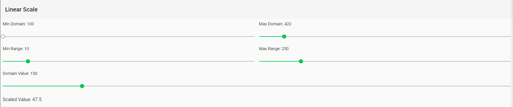

# Scales

Scales are functions that map from an input domain to an output range.

The values in any dataset are unlikely to correspond exactly to pixel measurements for use in your visualization. Scales provide a convenient way to map those data values to new values useful for visualization purposes.

d3 scales are *functions* with parameters that you define. Once they are created, you call the scale function and pass it a value, and it nicely returns a scaled output value. You can define and use as many scales as you like. A scale is a mathematical relationship, with no direct visual output.

A scale's *input domain* is the range of possible input data values, based on your real data. A scale's *output range* is the range of possible values, commonly used as display values in pixel units. The output range is completely up to you, as the information designer. If you decide that the shortest bar should be 10 pixels tall, and the tallest will be 350 pixels tall, then you could set an output range of 10 and 350.

For example, create a scale with an input domain of `[100, 500]` and an output range of `[10, 350]`. If you handed the low input value of 100 to that scale, it would return its lowest range value, 10. If you gave it 500, it would spit back 350. If you gave it 300, it would hand 180 back (300 is the center of the domain, and 180 is in the center of the range).

## Normalization

Normalization is the process of mapping a numeric value to a new value between 0 and 1, based on the possible minimum and maximum values. For example, with 365 days in the year, day number 310 maps to about 0.85, or 85% of hte way through the year.

With linear scales, we are just letting d3 handle the math of the normalization process. The input value is normalized according to the domain, and then the normalized value is scaled to the output range.

  
*See the example in [07-scales](./07-scales)*  

