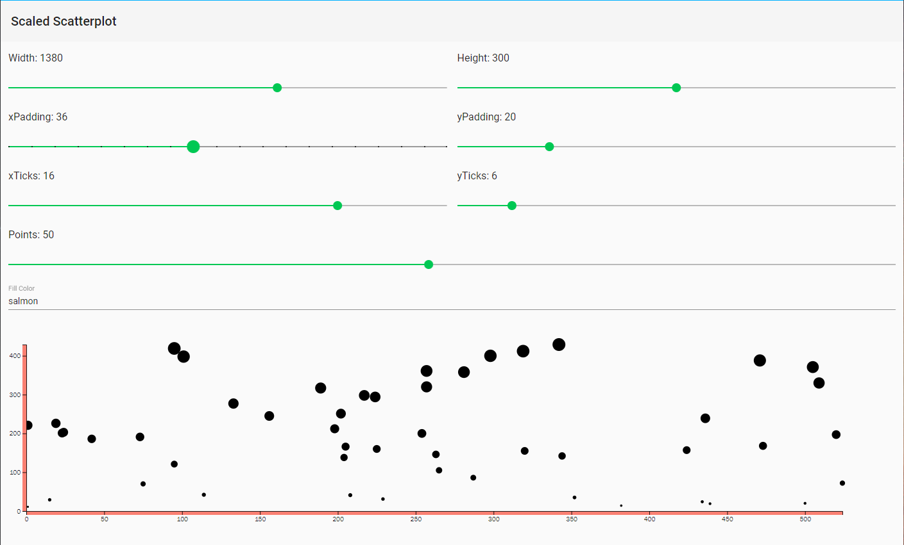

# Axes

[d3 axes](https://github.com/d3/d3-axis) are actually *functions* whose parameters you define. Unlike scales, when an axis function is called, it doesn't return a value, but generates the visual elements of the axis, including lines, labels, and ticks. Note that the axis functions are SVG-specific, as they generate SVG elements. Also, axes are inteded for use with quantitative scales (that is, scales that use numeric values, as opposed to ordinal, categorical ones).

## Setting Up an Axis

There are four different axis function constructors, each one corresponding to a different orientation and placement of labels: `d3.axisTop`, `d3.axisBottom`, `d3.axisLeft`, and `d3.axisRight`. For vertical axes, use `d3.axisLeft` or `d3.axisRight`, with ticks and labels appearing to the left and right, respectively. For horizontal axes, use `d3.axisTop` or `d3.axisBottom`, with ticks and labels appearing above and below, respectively.

**Basic axis configuration**  

```ts
@Input() dataset: number[][];
@Input() width = 500;
@Input() height = 300;
@Input() padding = 20;

xScale: d3.ScaleLinear<number, number>;
xAxis: d3.Axis<d3.AxisDomain>;

draw = () => {
    this.xScale = d3.scaleLinear()
      .domain([0, d3.max(this.dataset, d => d[0])])
      .range([this.padding, this.width - this.padding * 2]);

    this.xAxis = d3.axisBottom(this.xScale);

    this.svg.append('g')
      .attr('class', 'axis')
      .style('fill', this.fillColor)
      .call(this.xAxis);
}
```  

Because an *axis* function actually draws something to the screen (by appending SVG elements to the DOM), we need to specify *where* in the DOM it should place those new elements. This is in contrast to scale functions like `xScale()`, for example, which calculate a value and return those values, typically for use by yet another function, without impacting the DOM at all.

In the example configuration above, a new `g` element is appended to the SVG. A `g` element is a *group* element. Group elements are invisible, having no visual presence themselves. They can be used to contain (or "group") other elements, keeping the code nice and tidy. Additionally, *transformations* can be applied to `g` elements, which affects how visual elements within that group (such as lines, rects, and circles) are rendered.

[d3's call() function](https://github.com/d3/d3-selection/blob/master/README.md#selection_call) takes the incoming *selection*, as received from the prior link in the chain, and hands that selection off to any *function*. In the above example, the selection is the new `g` element. `call()` hands off `g` to the `xAxis` function, so the axis is generated *within* `g`.

## Positioning Axes

By default, an axis is positioned using the range of values of the specified scale. In the above case, `xAxis` is referencing `xScale`, which has a range of `[20, 460]`, because 20 pixels of padding are applied on all edges of the SVG. So the left edge of the axis appears at `x: 20` and the right edge at `x: 460`. This is great, as the axis should line up with the chart's visual marks, but the axis needs to be repositioned *veritcally*, as by convention, a bottom-oriented axis should appear at the bottom of the chart.

This is where SVG *transformations* come in, which can be accomplished with one line of code:

```ts
this.svg.append('g')
      .attr('class', 'axis')
      .attr('transform', `translate(0, ${this.height - this.padding})`)
      .style('fill', this.fillColor)
      .call(this.xAxis);
```

## Check for Ticks

[d3's ticks](https://github.com/d3/d3-axis/blob/master/README.md#axis_ticks) communicate information. Yet more ticks are not necessarily better, and at a certain point, they begin to clutter your chart. The amount of ticks on the axis, nor at what intervals should they appear, was never specified. Without clear instruction, d3 automagically examined `xScale` and made informed judgments about how many ticks to include, and at what intervals (every 50, in this case).

Even when you specify an amount of ticks, d3 will still make an executive decision to keep an amount of ticks based on values that are clean and human-readable. d3 interprest the `ticks()` value as merely a suggestion, even when that requires including slightly more or fewer ticks than your requested. This is actually a really helpful feature that increases the scalability of a design; as the dataset changes and the input domain expands or contracts (bigger numbers or smaller numbers), d3 ensures that the tick labels remain easy to read.

## Scatterplot with Axes

**scaled-scatterplot.component.html**

```html
<section #target
         class="container"></section>
```

**scaled-scatterplot.component.ts**

```ts
import {
  Component,
  Input,
  DoCheck,
  ViewChild,
  ElementRef
} from '@angular/core';

import * as d3 from 'd3';

@Component({
  selector: 'scaled-scatterplot',
  templateUrl: 'scaled-scatterplot.component.html'
})
export class ScaledScatterplotComponent implements DoCheck {
  @Input() dataset: number[][];
  @Input() width = 500;
  @Input() height = 300;
  @Input() xPadding = 20;
  @Input() yPadding = 20;
  @Input() xTicks = 16;
  @Input() yTicks = 6;
  @Input() fillColor = 'salmon';

  svg: d3.Selection<SVGSVGElement, unknown, HTMLElement, any>;
  xScale: d3.ScaleLinear<number, number>;
  yScale: d3.ScaleLinear<number, number>;
  aScale: d3.ScalePower<number, number>;
  xAxis: d3.Axis<d3.AxisDomain>;
  yAxis: d3.Axis<d3.AxisDomain>;

  @ViewChild('target', { static: true }) target: ElementRef;

  clear = () => this.svg.remove();

  draw = () => {
    this.xScale = d3.scaleLinear()
      .domain([0, d3.max(this.dataset, d => d[0])])
      .range([this.xPadding, this.width - this.xPadding * 2]);

    this.yScale = d3.scaleLinear()
      .domain([0, d3.max(this.dataset, d => d[1])])
      .range([this.height - this.yPadding, this.yPadding]);

    this.aScale = d3.scaleSqrt()
      .domain([0, d3.max(this.dataset, d => d[1])])
      .range([0, 10]);

    this.xAxis = d3.axisBottom(this.xScale)
      .ticks(this.xTicks)

    this.yAxis = d3.axisLeft(this.yScale)
      .ticks(this.yTicks)

    this.svg = d3.select(this.target.nativeElement)
      .append('svg')
      .attr('width', this.width + this.xPadding)
      .attr('height', this.height + this.yPadding);

    this.svg.selectAll('circle')
      .data(this.dataset)
      .enter()
      .append('circle')
      .attr('cx', d => this.xScale(d[0]))
      .attr('cy', d => this.yScale(d[1]))
      .attr('r', d => this.aScale(d[1]));

    this.svg.append('g')
      .attr('class', 'axis')
      .attr('transform', `translate(0, ${this.height - this.yPadding})`)
      .style('fill', this.fillColor)
      .call(this.xAxis);

    this.svg.append('g')
      .attr('class', 'axis')
      .attr('transform', `translate(${this.xPadding}, 0)`)
      .style('fill', this.fillColor)
      .call(this.yAxis);
  }

  ngDoCheck() {
    this.svg && this.clear();
    this.draw();
  }
}
```

**scatter-controls.html**

```html
<section fxLayout="column"
         fxLayoutAlign="start stretch"
         class="container">
  <section fxLayout="row"
           fxLayoutAlign="start center">
    <section fxLayout="column"
             fxLayoutAlign="start stretch"
             fxFlex>
      <p class="mat-subheading-2">Width: {{width}}</p>
      <mat-slider [value]="width"
                  [min]="400"
                  [max]="2000"
                  [step]="10"
                  [tickInterval]="10"
                  (input)="widthChange.emit($event.value)"></mat-slider>
    </section>
    <section fxLayout="column"
             fxLayoutAlign="start stretch"
             fxFlex>
      <p class="mat-subheading-2">Height: {{height}}</p>
      <mat-slider [value]="height"
                  [min]="100"
                  [max]="500"
                  [step]="10"
                  [tickInterval]="1"
                  (input)="heightChange.emit($event.value)"></mat-slider>
    </section>
  </section>
  <section fxLayout="row"
           fxLayoutALign="start center">
    <section fxLayout="column"
             fxLayoutAlign="start stretch"
             fxFlex>
      <p class="mat-subheading-2">xPadding: {{xPadding}}</p>
      <mat-slider [value]="xPadding"
                  [min]="4"
                  [max]="80"
                  [step]="4"
                  [tickInterval]="1"
                  (input)="xPaddingChange.emit($event.value)"></mat-slider>
    </section>
    <section fxLayout="column"
             fxLayoutAlign="start stretch"
             fxFlex>
      <p class="mat-subheading-2">yPadding: {{yPadding}}</p>
      <mat-slider [value]="yPadding"
                  [min]="4"
                  [max]="80"
                  [step]="4"
                  [tickInterval]="1"
                  (input)="yPaddingChange.emit($event.value)"></mat-slider>
    </section>
  </section>
  <section fxLayout="row"
           fxLayoutAlign="start center">
    <section fxLayout="column"
             fxLayoutAlign="start stretch"
             fxFlex>
      <p class="mat-subheading-2">xTicks: {{xTicks}}</p>
      <mat-slider [value]="xTicks"
                  [min]="4"
                  [max]="20"
                  [step]="1"
                  [tickInterval]="4"
                  (input)="xTicksChange.emit($event.value)"></mat-slider>
    </section>
    <section fxLayout="column"
             fxLayoutAlign="start stretch"
             fxFlex>
      <p class="mat-subheading-2">yTicks: {{yTicks}}</p>
      <mat-slider [value]="yTicks"
                  [min]="4"
                  [max]="20"
                  [step]="1"
                  [tickInterval]="4"
                  (input)="yTicksChange.emit($event.value)"></mat-slider>
    </section>
  </section>
  <section fxLayout="column"
           fxLayoutAlign="start stretch">
    <p class="mat-subheading-2">Points: {{points}}</p>
    <mat-slider [value]="points"
                [min]="5"
                [max]="100"
                [step]="1"
                [tickInterval]="10"
                (input)="pointsChange.emit($event.value)"></mat-slider>
  </section>
  <mat-form-field>
    <mat-label>Fill Color</mat-label>
    <input matInput
           [value]="fillColor"
           (keyup.enter)="fillColorChange.emit($event.target.value)" />
  </mat-form-field>
</section>
```

**scatter-controls.component.ts**

```ts
import {
  Component,
  Input,
  Output,
  EventEmitter
} from '@angular/core';

import { MatSliderChange } from '@angular/material/slider';

@Component({
  selector: 'scatter-controls',
  templateUrl: 'scatter-controls.component.html'
})
export class ScatterControlsComponent {
  @Input() width = 1700;
  @Input() height = 300;
  @Input() xPadding = 20;
  @Input() yPadding = 20;
  @Input() xTicks = 16;
  @Input() yTicks = 6;
  @Input() points = 50;
  @Input() fillColor = 'salmon';

  @Output() widthChange = new EventEmitter<number>();
  @Output() heightChange = new EventEmitter<number>();
  @Output() xPaddingChange = new EventEmitter<number>();
  @Output() yPaddingChange = new EventEmitter<number>();
  @Output() xTicksChange = new EventEmitter<number>();
  @Output() yTicksChange = new EventEmitter<number>();
  @Output() pointsChange = new EventEmitter<number>();
  @Output() fillColorChange = new EventEmitter<string>();
}
```

**home.component.html**

```html
<mat-toolbar>Scaled Scatterplot</mat-toolbar>
<scatter-controls [width]="width"
                  [height]="height"
                  [xPadding]="xPadding"
                  [yPadding]="yPadding"
                  [xTicks]="xTicks"
                  [yTicks]="yTicks"
                  [points]="points"
                  [fillColor]="fillColor"
                  (widthChange)="updateWidth($event)"
                  (heightChange)="updateHeight($event)"
                  (xPaddingChange)="updateXPadding($event)"
                  (yPaddingChange)="updateYPadding($event)"
                  (xTicksChange)="updateXTicks($event)"
                  (yTicksChange)="updateYTicks($event)"
                  (pointsChange)="updatePoints($event)"
                  (fillColorChange)="updateFillColor($event)"></scatter-controls>
<scaled-scatterplot [dataset]="dataset"
                    [width]="width"
                    [height]="height"
                    [xPadding]="xPadding"
                    [yPadding]="yPadding"
                    [xTicks]="xTicks"
                    [yTicks]="yTicks"
                    [fillColor]="fillColor"></scaled-scatterplot>
```

**home.component.ts**

```ts
import {
  Component,
  OnInit
} from '@angular/core';

@Component({
  selector: 'home',
  templateUrl: './home.component.html',
})
export class HomeComponent implements OnInit {
  dataset = [
    [5, 20],
    [480, 90],
    [250, 50],
    [100, 33],
    [330, 95],
    [410, 12],
    [475, 44],
    [25, 67],
    [85, 21],
    [220, 88]
  ];

  width = 1380;
  height = 300;
  xPadding = 20;
  yPadding = 20;
  xTicks = 16;
  yTicks = 6;
  fillColor = 'salmon';
  points = 50;

  updateWidth = (event: number) => this.width = event;
  updateHeight = (event: number) => this.height = event;
  updateXPadding = (event: number) => this.xPadding = event;
  updateYPadding = (event: number) => this.yPadding = event;
  updateXTicks = (event: number) => this.xTicks = event;
  updateYTicks = (event: number) => this.yTicks = event;
  updateFillColor = (event: string) => this.fillColor = event;

  updatePoints = (event: number) => {
    this.points = event;
    this.dataset = this.generateDataset();
  };

  private generateDataset = () : number[][] => {
    const data = new Array<number[]>();

    const xRange = Math.random() * 1000;
    const yRange = Math.random() * 1000;

    for (let i = 0; i < this.points; i++) {
      const x = Math.floor(Math.random() * xRange);
      const y = Math.floor(Math.random() * yRange);
      data.push([x, y]);
    }

    return data;
  }

  ngOnInit() {
    this.dataset = this.generateDataset();
  }
}
```  

[](.images/08-scatterplot-axes.png)

> See also: [d3-scale - tickFormat()](https://github.com/d3/d3-scale#continuous_tickFormat) and [d3-format - locale.format()](https://github.com/d3/d3-format#locale_format)