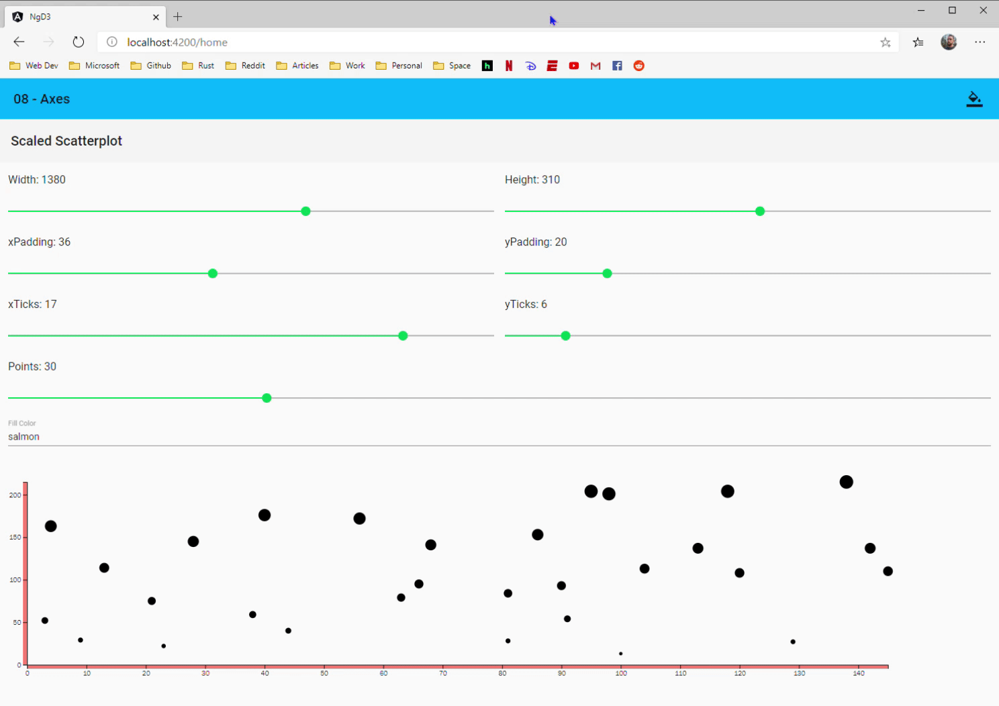

# Interactive Data Visualization - Angular Study

  

This repository represents a self-study intended to re-familiarize my [d3.js](https://d3js.org) foundations, while simultaneously establishing some best practices for building d3-centric Angular components.

All of this is based on [Scott Murray's](https://github.com/scotthmurray) excellent book [Interactive Data Visualization for the Web](http://shop.oreilly.com/product/0636920037316.do).